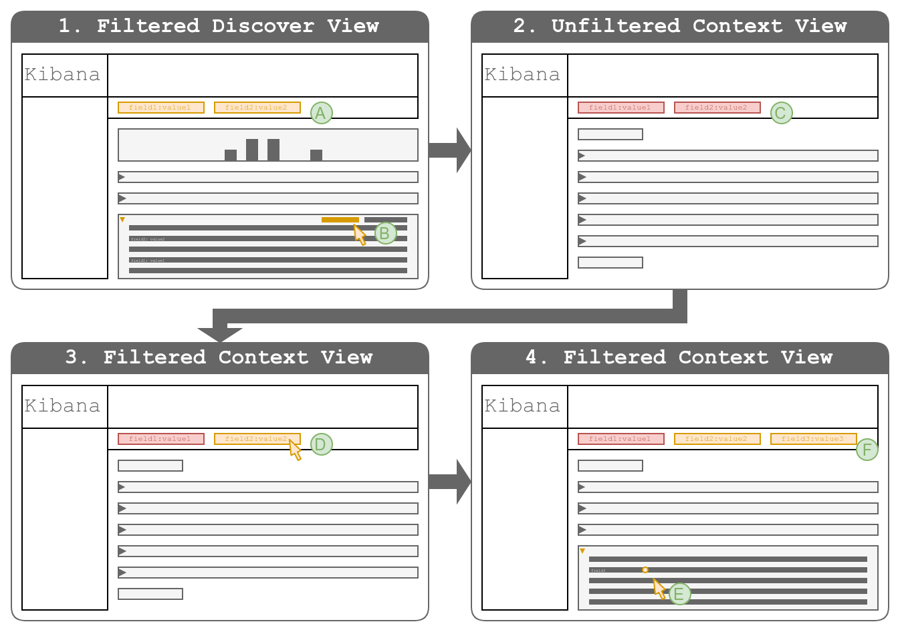

# Solution 1: Apply Disabled Copies of Filters When Switching

## Outline

1. The user creates a set of filters and a query to identify the anchor event.
2. The user clicks the UI element to switch to the filtered Context view.
3. The Context view is shown with copies of the filters that were 
   previously applied to the Discover view, (some) in a disabled state.
4. *[optional]* The user re-enables those filters suitable for the use-case.
5. *[optional]* The user adds new filters by clicking the appropriate icons in 
   the document table.

## Discussion

* **PRO**: Setting up filters in the Discover view is already part of the 
  workflow.
* **PRO**: The context can be defined via multiple filters.
* **PRO**: The context can be defined via filters that were not applied in the 
  Discover view.
* **CON**: The Context view will often require additional configuration steps 
  to be "useful".
* **CON**: The context definitions are not persisted.

## Variations

This section explores more detailed variations of the solution. They relate to 
different degrees of freedom of the implementation. The overall solution will 
therefore be a combination of these:

* **E**ntry: the ways in which the user can enter the Context view from the 
  Discover view

### Variation E1: A Link per Document with Enabled Filters

* The document table contains a link in each document's expanded details row.
* The Context view has copies of all filters previously applied to the Discover 
  view.

#### Discussion

* **PRO**: A Context view link in each document's expanded detail rows is 
  already present.
* **CON**: The Context view will often require additional configuration steps 
  to be "useful".

### Variation E2: A Link per Document with Fully Disabled Filters

* The document table contains a link in each document's expanded details row.
* The Context view has disabled copies of all filters previously applied to the 
  Discover view.

#### Discussion

* **PRO**: A Context view link in each document's expanded detail rows is 
  already present.
* **CON**: The Context view will often require additional configuration steps 
  to be "useful".

### Variation E3: An Icon per Field with Disabled Filters and an Enabled Term Filter

* The document table contains an icon link in each field's row of each 
  document's expanded details row.
* The Context view has disabled copies of all filters previously applied to the 
  Discover view.
* The Context view also has an enabled term filter for the value of the field 
  the link of which was clicked.

#### Discussion

* **PRO**: Icons in each field's row of each document's expanded details row 
  are already an established pattern.
* **PRO**: The Context view requires no additional configuration for contexts 
  defined by a single field.
* **CON**: The number of icons in each field's row might grow too unwieldy.

## Workflows

Workflows illustrate concrete user workflows by combining the basic solution 
with one or more variations described above.

### Workflow 1

* Combination of E2 and E3

* **A**: The user uses the filters and query bar to find relevant events in the 
  Discover view.
* **B**: The user expands a row and clicks the link that switches to the 
  Context view.
* **C**: The context view is unfiltered, but contains disabled copies of the 
  filters previously defined in the Discover view.
* **D**: The user re-enables some of the previously defined filters to narrow 
  down the context. The view refreshes automatically.
* **E**: The user adds more term filters via the icons in the document details 
  to narrow down the context. The view refreshes automatically.
* **F**: The filter bar contains the previous filters as well as the newly 
  added filters, which can then be manipulated as usual.
