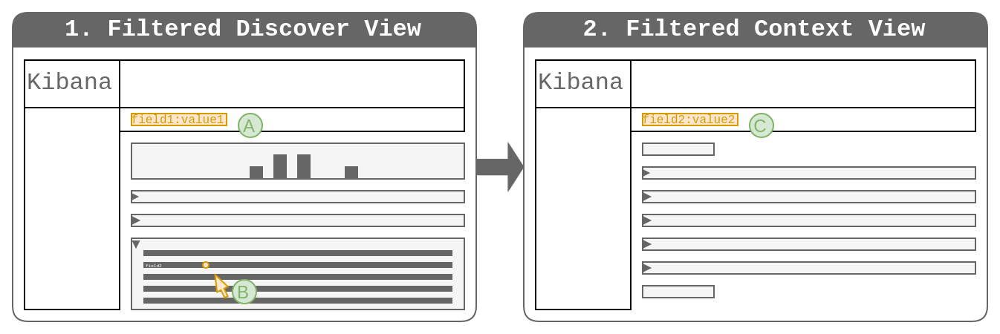

# Solution 2: Create a filter based on a field selected by the user when switching

## Outline
1. The user creates a set of filters and a query to identify the anchor event.
2. The user clicks the UI element present in each field in an expanded row to 
   switch to the context view.
3. The context view is filtered by the term for that respective field.

## Discussion

* **PRO**: Actions for individual fields in the expanded details of a row is a 
  concept already established in Discover.
* **PRO**: The context is immediately "useful".
* **CON**: The context can only be defined via a single field.

## Workflows

### Workflow 1

* **A**: The user creates a set of filters to identify the anchor event.
* **B**: The user clicks the icon present in each field in an expanded row.
* **C**: The context view is filtered by the term for that respective field.
